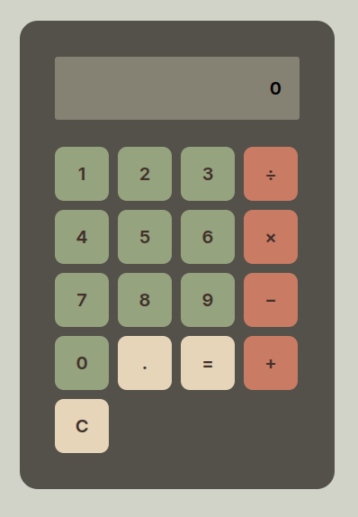

# Project: Calculator

A browser-based calculator built with vanilla JavaScript, HTML, and CSS as part of The Odin Project Foundations curriculum.

The goal of this project was to take the core concepts from Foundations and combine them into a complete interactive application, focusing on DOM manipulation, state management, user input handling, and application logic without relying on external libraries or `eval()`.

## Overview

This project started as a simple calculator assignment, but quickly became an exercise in managing application state and user interaction cleanly.

Some of the main areas of focus included:

- Building reusable math and helper functions
- Managing calculator state across chained operations
- Dynamically updating the DOM based on user input
- Handling invalid input and edge cases safely
- Structuring logic in a way that stays readable as complexity grows
- Implementing calculation logic manually instead of using `eval()`

The calculator uses a lightweight finite state machine (FSM)-style approach to keep input flow predictable and avoid ambiguous calculator behaviour.

## Features

### Core Functionality

- Addition, subtraction, multiplication, and division
- Sequential calculations (`12 + 7 - 3`)
- Clear/reset functionality
- Chained operations using previous results

### User Interaction

- Click-based number and operator input
- Live display updates
- Operator replacement before second operand entry
- Leading zero handling for decimal input (`0.5` instead of `.5`)

### Edge Case Handling

- Prevents division by zero crashing
- Prevents multiple decimals in the same operand
- Prevents invalid calculations from incomplete expressions
- Handles repeated operator input safely
- Basic overflow protection for long display values

## Technical Approach

Rather than parsing full mathematical expressions, the calculator evaluates operations step-by-step using explicit state management.

### State Flow

The application moves between a small set of controlled states:

- `IDLE`
- `OPERAND1_ACTIVE`
- `OPERAND2_WAIT`
- `OPERAND2_ACTIVE`
- `RESULT`

Keeping the calculator state explicit helped simplify input handling and made debugging much easier as more edge cases appeared during development.

### Operation Flow

1. Number buttons build the active operand
2. Operator buttons update calculator state
3. `operate()` routes calculations based on the selected operator
4. Results are stored and reused for chained operations

## Project Structure

### Main Documentation

- [`DESIGN.md`](./DESIGN.md)  
  MVP planning, assignment constraints

- [`DEV_LOG.md`](./DEV_LOG.md)  
  Development notes, implementation & debugging checklists

- [`LOGIC_NOTES.md`](./LOGIC_NOTES.md)  
  Calculator logic, state transitions, source code documentation

## Tech Stack

- HTML5
- CSS3
- JavaScript (ES6)

No frameworks or external dependencies were used.

## Key Learning Outcomes

This project was mainly an opportunity to get more comfortable with:

- DOM manipulation and event handling
- Managing application state in JavaScript
- Breaking larger problems into smaller helper functions
- Handling UI edge cases and user-flow
- Writing more maintainable conditional logic

## Future Improvements

I completed the MVP for this assignment. Future improvements can include:

- Keyboard support
- Backspace/delete functionality
- Improved display overflow handling
- Responsive/mobile layout refinements
- Refactoring repeated logic into reusable utilities

## Limitations

- Operations are evaluated sequentially (does not use operator precedence)
- Extremely large numbers exceed display limits

## Assignment

Built for the [calculator project](https://www.theodinproject.com/lessons/foundations-calculator) from [The Odin Project: Foundations](https://www.theodinproject.com/lessons/foundations-calculator?utm_source=chatgpt.com) open-source curriculum.
